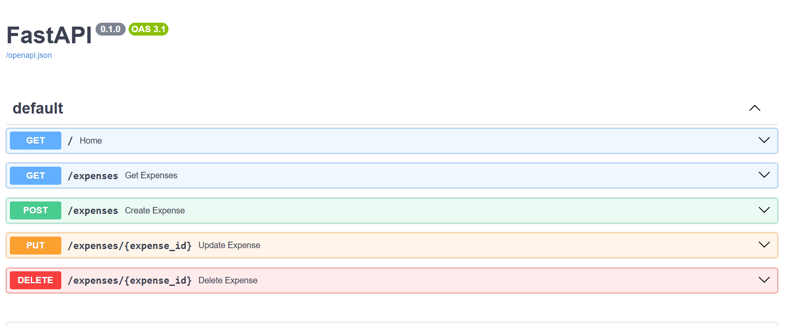
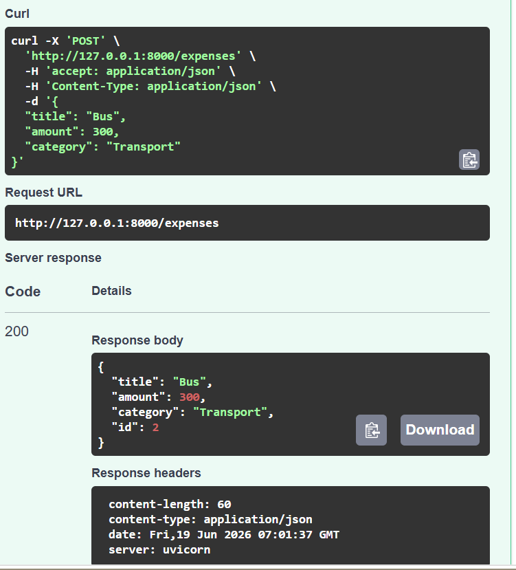
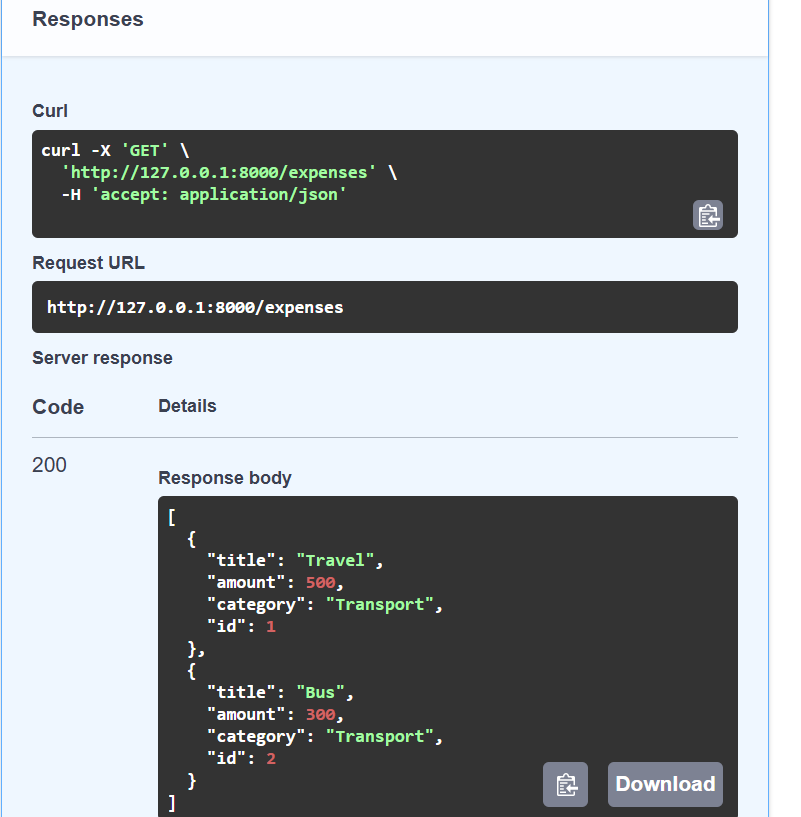
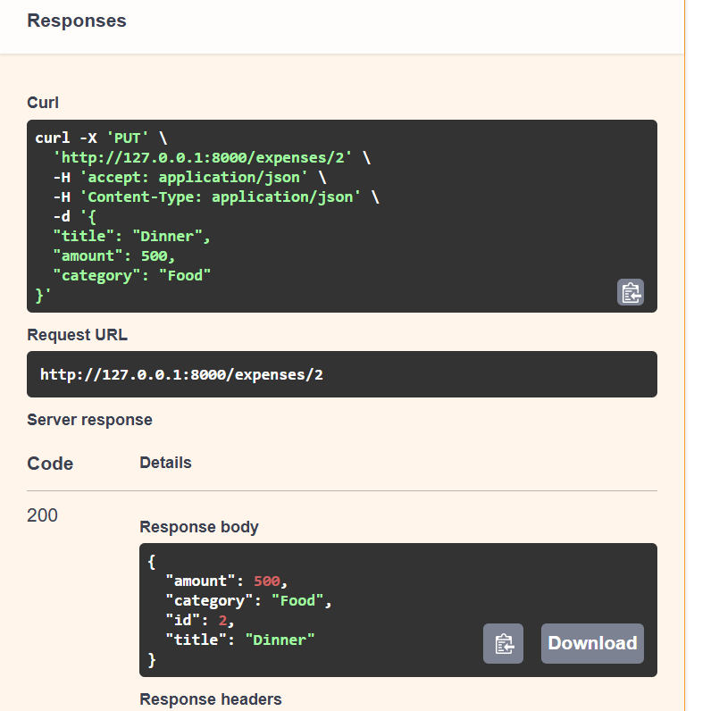
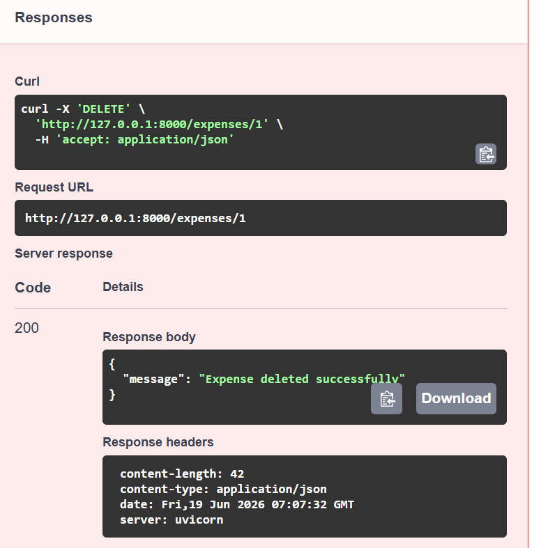

# Expense Tracker REST API

A RESTful API built using FastAPI and MySQL for managing expense transactions efficiently. The project implements complete CRUD operations with SQLAlchemy ORM and interactive API documentation using Swagger UI.

## Features

* Create expenses
* View expenses
* Update expenses
* Delete expenses
* Exception handling
* Automatic API documentation
* MySQL database integration

## Tech Stack

* Python
* FastAPI
* MySQL
* SQLAlchemy
* Uvicorn
* Swagger UI

## Folder Structure

```
Expense-Tracker-API
│
├── main.py
├── database.py
├── models.py
├── schemas.py
├── crud.py
├── requirements.txt
├── README.md
└── screenshots
```

## API Endpoints

| Method | Endpoint       | Description    |
| ------ | -------------- | -------------- |
| GET    | /              | Home           |
| POST   | /expenses      | Create Expense |
| GET    | /expenses      | Get Expenses   |
| PUT    | /expenses/{id} | Update Expense |
| DELETE | /expenses/{id} | Delete Expense |

## Installation

```bash
git clone https://github.com/KousalyaBanda/Expense-Tracker-API.git

cd Expense-Tracker-API

pip install -r requirements.txt

uvicorn main:app --reload
```

## Swagger Documentation

Visit:

```
http://127.0.0.1:8000/docs
```

## Screenshots

### Swagger UI



### Create Expense



### Get Expenses



### Update Expense



### Delete Expense



## Future Enhancements

* JWT Authentication
* User Accounts
* Monthly Reports
* Docker Deployment

## Author

Kousalya Banda
